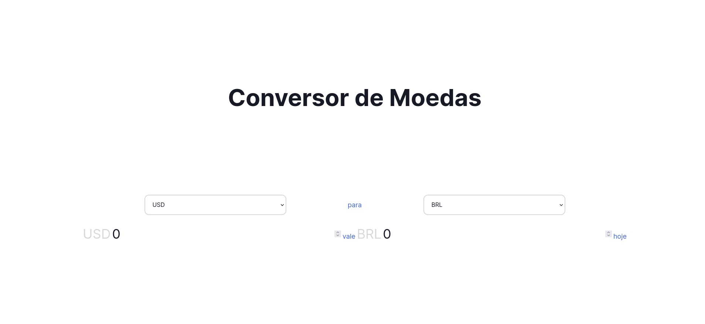

<p align="center">
  &nbsp;
  &nbsp;
  &nbsp;
</p>

<h1 align="center">
  
</h1>

<h3 align="center">Conversor de moedas</h3>

<!--ts-->

- [Sobre o projeto](#sobre-o-projeto)
- [Como executar o projeto](#como-executar-o-projeto)
  - [Pré-requisitos](#pré-requisitos)
- [Tecnologias](#tecnologias)
<!--te-->

<a href="https://currency-converter-coral.vercel.app/" rel="external" target="_blank"><h2 align="center">Acessar versão final</h2></a>

## Sobre o projeto

💬 **Conversor de moedas** - é uma aplicação que tem o intuito de converter moedas com a cotação mais atual.

Utilizando a versão gratuita da API [ExchangeRatesAPI](https://exchangeratesapi.io/), a cotação é atualizada a cada hora.

<h4 align="center"><strong>Versão mobile</strong></h4>
<p align="center"></p>


---

## Como executar o projeto

### Pré-requisitos

Antes de começar, é necessário ter instalado em sua máquina as seguintes ferramentas:
[Git](https://git-scm.com), [Node.JS](https://nodejs.org/en/), [Yarn](https://classic.yarnpkg.com/lang/en/docs/install/#debian-stable).
Além disso, um bom editor para trabalhar com código como [VSCode](https://code.visualstudio.com/).

```bash
  # Clonar o respositório
  $ git clone https://github.com/MatheusFLemma/currency-converter.git

  # Entrar no diretório
  $ cd currency-converter

  # Instalar as dependências
  $ yarn install

  # Iniciar o projeto
  $ yarn dev

  # O servidor iniciará na porta:3000 - acesse: http://localhost:3000
```

## Tecnologias

O projeto foi desenvolvido utilizando as seguintes tecnologias

<p align="center">
<a href="https://www.typescriptlang.org/" rel="external" target="_blank"></a>&nbsp;&nbsp;&nbsp;
<a href="https://pt-br.reactjs.org/" rel="external" target="_blank"></a>&nbsp;&nbsp;&nbsp;
<a href="https://vitejs.dev/" rel="external" target="_blank"></a>&nbsp;&nbsp;&nbsp;
<a href="https://tailwindcss.com/" rel="external" target="_blank"></a>&nbsp;&nbsp;&nbsp;
<a href="https://pages.github.com/" rel="external" target="_blank"></a>
</p>
